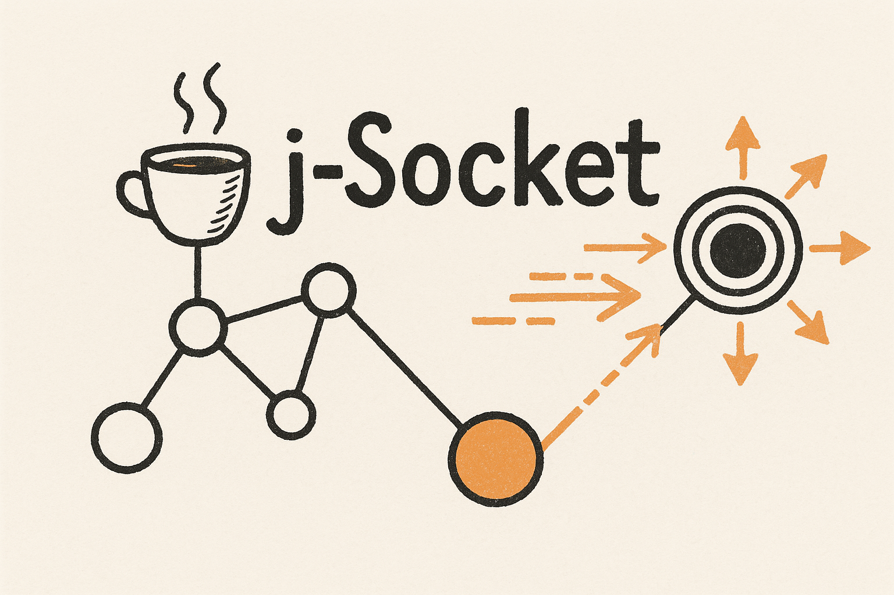
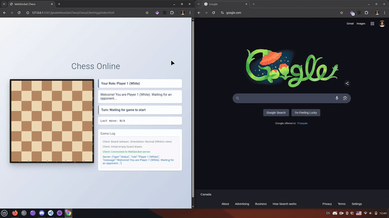

# JSocket 🚀

[](https://opensource.org/licenses/MIT)
[](https://www.java.com)

#### A lightweight, easy-to-understand Java WebSocket server for real-time applications



JSocket provides a simple yet powerful WebSocket implementation in Java with no external dependencies. Perfect for learning WebSocket internals, building custom real-time features, or integrating into existing Java applications.

#### Video Below is just an example of what the JSocket can do



*Chess game demo built with JSocket*

## ✨ Features

- **Beginner-friendly** code structure with extensive documentation
- **RFC 6455 compliant** WebSocket implementation
- **Concurrent client handling** with dedicated reader/writer threads
- **Event-driven architecture** via simple listener interface
- **Working Chess game demo** showcasing real-time capabilities
- **Zero external dependencies** - just pure Java

## 🚀 Quick Start

### Run the Chess Demo

```bash
# Clone the repository
git clone https://github.com/AceAtDev/JSocket--java-simple-websocket
cd JSocket

# Run the Chess server (using your IDE or command line)
java javaWebsocketChess.chess.ChessServerMain

# Open in browser: javaWebsocketChess/chess/clientApp/index.html
# (Open in two tabs to play against yourself)
```

### Use JSocket in Your Project

1️⃣ **Copy the core files** from `javaWebsocketChess/websocketCore/` into your project

2️⃣ **Create your handler:**

```java
public class MyWebSocketHandler implements WebSocketListener {
    @Override
    public void onOpen(ClientHandler connection) {
        connection.sendMessage("Welcome!");
    }

    @Override
    public void onMessage(ClientHandler connection, String message) {
        System.out.println("Received: " + message);
        connection.sendMessage("You said: " + message);
    }

    @Override
    public void onClose(ClientHandler connection, int code, String reason, boolean remote) {
        System.out.println("Connection closed: " + reason);
    }

    @Override
    public void onError(ClientHandler connection, Exception ex) {
        ex.printStackTrace();
    }
}
```

3️⃣ **Start the server:**

```java
public static void main(String[] args) {
    WebSocketServer server = new WebSocketServer(8888, new MyWebSocketHandler());
    try {
        server.start();
        System.out.println("WebSocket server running on port 8888");
    } catch (IOException e) {
        e.printStackTrace();
    }
}
```

## 🧩 Key Components

JSocket's architecture is simple but powerful:

- **`WebSocketServer`**: Manages TCP connections and handshakes
- **`ClientHandler`**: Manages WebSocket connection lifecycle
- **`WebSocketDataReader/Writer`**: Handle frame reading/writing
- **`WebSocketFrame`**: Represents WebSocket protocol frames
- **`WebSocketListener`**: Interface for your application logic

## 🔍 Use Cases

- **Learning WebSocket internals** without complex dependencies
- **Real-time chat applications**
- **Multiplayer games** (like the included Chess demo)
- **Live dashboards and monitoring tools**
- **Adding WebSocket capability** to existing Java applications

## 📚 Documentation

For more detailed information:

- **[how it works](docs/HowItWorks.md)** - Detailed description of classes and methods

## 🤝 Contributing

Contributions are welcome! Whether it's bug reports, feature requests, or code contributions:

- Fork the repository
- Create your feature branch: `git checkout -b feature/amazing-feature`
- Commit your changes: `git commit -m 'Add some amazing feature'`
- Push to the branch: `git push origin feature/amazing-feature`
- Open a Pull Request

## 📄 License

JSocket is [MIT licensed](LICENSE.md).

---

#### Developed with ❤️ for the craft of developing

[Report Bug](https://github.com/AceAtDev/JSocket--java-simple-websocket-/issues) •
[Request Feature](https://github.com/AceAtDev/JSocket--java-simple-websocket-/issues)

---

## 🙏 Acknowledgements

Special thanks to the amazing [python-websockets/websockets](https://github.com/python-websockets/websockets) project for their wonderful documentation, which was invaluable in creating this repository.
